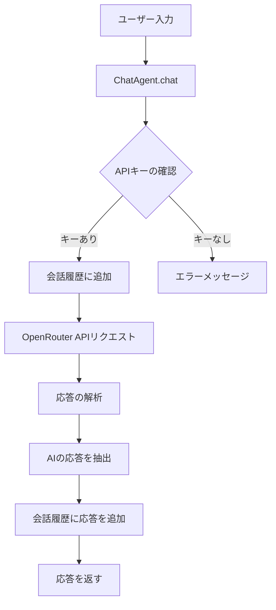
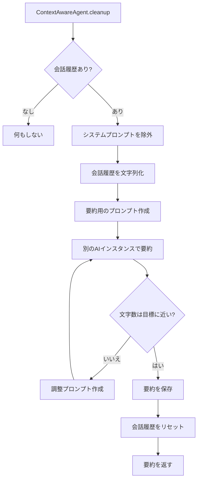
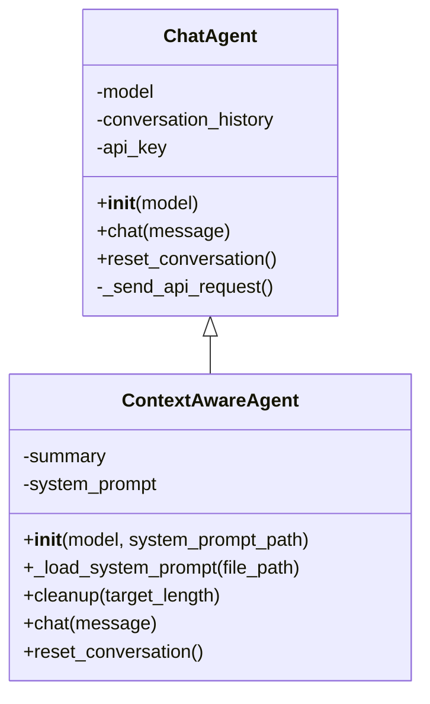

# 🤖 ChatAgent プログラム超絶解説書

## 📚 目次

1. [プログラム概要](#プログラム概要)
2. [セットアップ方法](#セットアップ方法)
3. [主要クラスと機能](#主要クラスと機能)
   - [ChatAgentクラス](#chatagentクラス)
4. [使用例](#使用例)
5. [応用例とカスタマイズ](#応用例とカスタマイズ)
6. [動作の仕組み](#動作の仕組み)

---

## 📋 プログラム概要

### これは何？

**ChatAgent**は、OpenRouter APIを使って様々なAIモデル（GeminiやGPTなど）と簡単に会話できるPythonプログラムです。

### 主な特徴

- ✅ **簡単な会話機能**: 数行のコードでAIとの会話を実現
- ✅ **会話履歴の管理**: 複数回のやり取りを記憶して文脈を維持
- ✅ **会話の要約機能**: 長い会話を自動的に要約して記憶容量を節約
- ✅ **複数のAIモデル対応**: OpenRouterを通じて様々なAIモデルを利用可能

### 使用技術

- Python 3.6以上
- requests ライブラリ（HTTPリクエスト用）
- python-dotenv（環境変数管理用）
- OpenRouter API（AIモデルへのアクセス）

---

## 🔧 セットアップ方法

### 1. 必要なパッケージのインストール

```bash
pip install requests python-dotenv
```

### 2. OpenRouter APIキーの取得

1. [OpenRouter](https://openrouter.ai/)にアクセスしてアカウントを作成
2. ダッシュボードからAPIキーを発行
3. コピーしたAPIキーを`.env`ファイルに設定

### 3. 環境変数の設定

プロジェクトのルートディレクトリに`.env`ファイルを作成し、以下の内容を記述：

```
OPENROUTER_API_KEY=あなたのOpenRouterAPIキー
```

> ⚠️ **注意**: APIキーは秘密情報です。GitHubなどに公開しないでください。

---

## 🧩 主要クラスと機能

### ChatAgentクラス

基本的な会話機能を提供するクラスです。

#### 主なメソッド

| メソッド | 説明 | 引数 | 戻り値 |
|---------|------|------|--------|
| `__init__` | エージェントの初期化 | `model`: 使用するAIモデル名 | なし |
| `chat` | AIと会話する | `message`: ユーザーメッセージ | AIの応答文字列 |
| `reset_conversation` | 会話履歴をリセット | なし | なし |

#### 内部の仕組み

1. ユーザーメッセージを受け取る
2. 会話履歴に追加
3. OpenRouter APIにリクエスト送信
4. AIの応答を取得して返す
5. AIの応答も会話履歴に追加

```python
# 基本的な使い方
from scripts.agent import ChatAgent

agent = ChatAgent()  # デフォルトはGemini 2.0 Flash Lite
response = agent.chat("こんにちは！")
print(response)  # AIからの応答を表示
```


### ContextAwareAgentクラス

ChatAgentを拡張し、システムプロンプトの読み込みと会話履歴の要約の両方の機能を持つクラスです。

#### 追加されたメソッド

| メソッド | 説明 | 引数 | 戻り値 |
|---------|------|------|--------|
| `__init__` | エージェントの初期化 | `model`: 使用するAIモデル名<br>`system_prompt_path`: システムプロンプトファイルのパス | なし |
| `_load_system_prompt` | システムプロンプトを読み込む | `file_path`: ファイルパス | なし |
| `reset_conversation` | 会話履歴をリセット（システムプロンプトは保持） | なし | なし |
| `cleanup` | 会話履歴を要約して圧縮（システムプロンプトは除外） | `target_length`: 目標文字数 | 生成された要約文 |

#### 内部の仕組み

1. コンストラクタでシステムプロンプトファイルのパスを受け取る
2. ファイルからシステムプロンプトを読み込み、内部変数に保持
3. 会話履歴の先頭にシステムプロンプトを追加
4. 会話履歴をリセットする際もシステムプロンプトは保持
5. 要約する際はシステムプロンプトを除外して要約を生成

```python
# システムプロンプトと要約機能の使い方
from scripts.agent import ContextAwareAgent

# システムプロンプトファイルを指定してエージェントを作成
agent = ContextAwareAgent(system_prompt_path="scripts/system_prompt.txt")

# 会話の実行
response = agent.chat("「は」と「が」の違いを教えてください")
print(f"AI: {response}")

# 会話を要約（システムプロンプトは除外される）
summary = agent.cleanup(150)
print(f"会話要約: {summary}")

# 要約を踏まえた上で会話を継続（システムプロンプトは維持される）
agent.chat("助詞「に」と「へ」の違いは？")
```

---

## 🚀 使用例

### 基本的な会話

```python
from scripts.agent import ChatAgent

# エージェントの作成
agent = ChatAgent()

# 会話の実行
response1 = agent.chat("Pythonについて教えてください")
print(f"AI: {response1}")

response2 = agent.chat("初心者が最初に学ぶべきことは？")
print(f"AI: {response2}")
```

### 会話履歴の要約と管理

```python
from scripts.agent import ContextAwareAgent

# 要約機能付きエージェントの作成
agent = ContextAwareAgent()

# いくつかの質問をする
agent.chat("機械学習とは何ですか？")
agent.chat("ディープラーニングとの違いは？")
agent.chat("自己学習するシステムを作るには？")

# 会話を200文字程度に要約
summary = agent.cleanup(200)
print(f"会話要約: {summary}")

# 要約を踏まえた上で会話を継続
agent.chat("実際のビジネス応用例を教えてください")
```

### コマンドラインでの操作

プログラムを直接実行すると、インタラクティブモードで会話できます：

```bash
python scripts/agent.py
```

**使用可能なコマンド**:
- 通常のテキスト: AIに送信されるメッセージ
- `summary [文字数]`: 会話を指定文字数に要約（例: `summary 100`）
- `exit`: プログラムを終了

---

## 🔄 応用例とカスタマイズ

### 異なるAIモデルの使用

```python
# GPT-4oを使用する例
from scripts.agent import ChatAgent

gpt4_agent = ChatAgent(model="openai/gpt-4o")
response = gpt4_agent.chat("複雑な数学の問題を解いてください")
```

### システムプロンプトの追加

```python
from scripts.agent import ChatAgent

agent = ChatAgent()

# システムプロンプトを会話履歴に追加
agent.conversation_history.append({
    "role": "system", 
    "content": "あなたは親切な日本語教師です。簡潔に、わかりやすく回答してください。"
})

response = agent.chat("「は」と「が」の違いを教えてください")
```

### 会話ログの保存

```python
import json
from scripts.agent import ChatAgent

agent = ChatAgent()
agent.chat("こんにちは")
agent.chat("今日の天気は？")

# 会話履歴をJSONファイルに保存
with open("conversation_log.json", "w", encoding="utf-8") as f:
    json.dump(agent.conversation_history, f, ensure_ascii=False, indent=2)
```

---

## ⚙️ 動作の仕組み

### 会話処理のフロー



### 要約機能の仕組み



### ChatAgentとContextAwareAgentの関係



---

## 📝 まとめ

**ChatAgent**は、OpenRouter APIを使って様々なAIモデルと簡単に会話できるPythonプログラムです。基本的な会話機能を提供する`ChatAgent`クラスと、システムプロンプトの読み込みと会話履歴の要約の両方の機能を持つ`ContextAwareAgent`クラスで構成されています。

APIキーを設定するだけで、数行のコードでAIとの会話を実現できます。また、長い会話も自動的に要約して記憶容量を節約できるため、文脈を維持したまま効率的に会話を続けることができます。

様々なAIモデルに対応しているため、用途に応じて最適なモデルを選択できます。また、シンプルな設計なので、カスタマイズも容易です。

---

*このドキュメントは2025年4月3日に作成されました*
